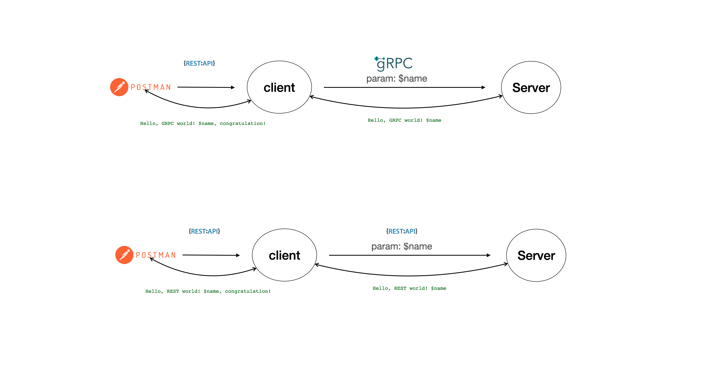

# GRPC sample project

- protocol buffers 사용
- 단순 string api를 rest api vs protobuf api 비교

위 프로젝트에서는 https://github.com/LogNet/grpc-spring-boot-starter 를 활용하게 되었습니다.
하지만, armeria를 도입하는 것이 유지보수 측면에서 좀 더 좋은 방법이라고 생각 합니다.

### grpc support framework

- https://github.com/LogNet/grpc-spring-boot-starter
    - https://github.com/LogNet/grpc-spring-boot-starter/blob/master/ReleaseNotes.md
- https://github.com/yidongnan/grpc-spring-boot-starter
- https://github.com/line/armeria
- ktor의 경우 제한적으로 사용 가능
    - https://youtrack.jetbrains.com/issue/KTOR-1501
    - grpc server starter의 구현은 여름에 런칭 계획 중

https://www.reddit.com/r/SpringBoot/comments/1255u5x/spring_boot_and_grpc/

- 특별히 spring boot3를 쓰지 않는 한, 둘 중에 뭘 쓰거나 상관 없어 보인다.
- lognet 구현체가 좀 더 구성이 잘 되어 있다.
    - spring boot 지원 버전이 더 최신성을 잘 반영 함.
    - native spring은 지원이 잘 안되는 것 같다. (issue의 버그 제기 있는 상태)
- 다른 모듈 support 은 yidongnan 모듈이 좀 더 잘 지원한다.
    - https://yidongnan.github.io/grpc-spring-boot-starter/en/versions.html
        - 2.15.0 버전은 spring boot 2.7.5 버전/spring cloud 2021.0.5버전을 지원 예정
        - 2.14.0 버전은 spring boot 2.6.13/spring cloud 2021.0.5버전 지원
    - 문제점은 spring boot 기반 start의 모듈은 official 모듈이 없고, 3th-party 모듈이 유지보수한다.
        - 과연 써도 될까?
    - armeria를 도입 하는 것이 좋은 장점이 될 수 있음.
        - **HTTP/GRPC 둘다 서비스 가능**
        - RPC docs 지원
        - Spring과 integration support 가능
            - **armeria + spring 두개를 띄워서 서비스 가능**하여, 별도 migration의 노고가 줄어든다.

## 구조

- server api <---- api call ----- client api <----- http client / grpc client (ex. postman)
- local https 활성화 필요

## 사용 버전

- buildSrc/src/main/kotlin/Versions.kt 참조

### https tool

- [mkcert](https://github.com/FiloSottile/mkcert) 툴 사용

### protobuf docs

protobuf docs

- https://protobuf.dev/

### grpc docs

- https://grpc.io/docs/

### sample api test 구조도

